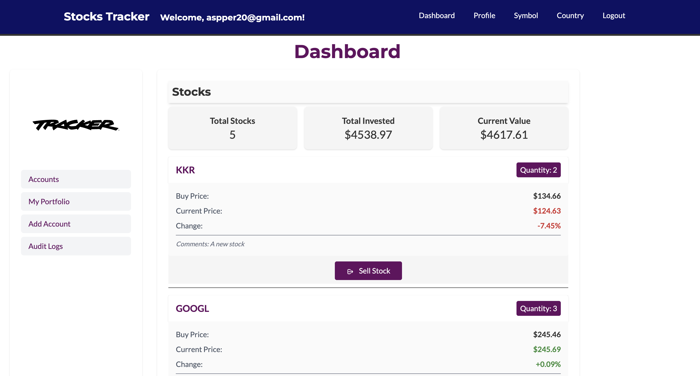
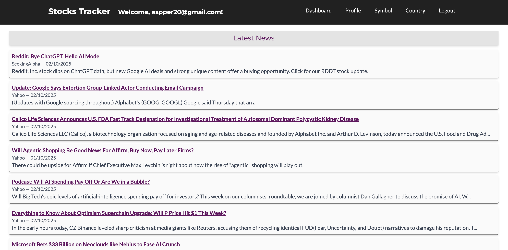
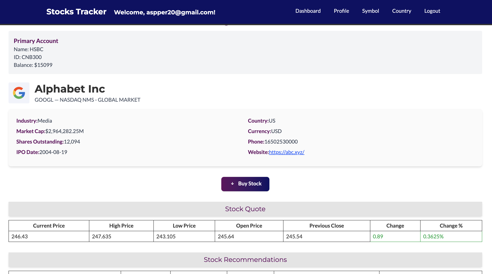
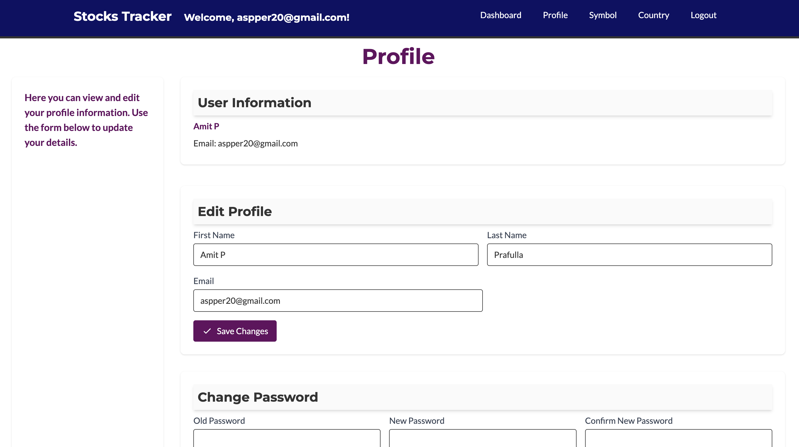

<div align="center">

<div>
    
    
    
    
    
    
    
    
    
    
    
</div>

  <h3 align="center">Virtual Stock Trader App in Vue</h3>
</div>

## 📋 <a name="table">Table of Contents</a>

1. ✨ [Introduction](#introduction)
2. ⚙️ [Tech Stack](#tech-stack)
3. 🔋 [Features](#features)
4. 🤸 [Quick Start](#quick-start)
5. 🔗 [Assets](#links)
6. 🚀 [More](#more)

## 🚨 Intro

This repository contains the UI for the virtual stock trader app.

[Here's the link to the back-end API for this application.](https://github.com/Apfirebolt/stock_tracker_api_express)

I choose Vue to write it because this is the modern framwork I'm most comfortable with. I always wanted to create a virtual stock trading platform where you can test your trading skills without real money being involved. This also contains a lot of other features as well.

## <a name="introduction">✨ Introduction</a>

A modern virtual stock trader app built with Vue.js, Tailwind CSS, Express, MongoDB, Nginx and Headless UI. Track real-time prices, set personalized alerts, explore company insights, and manage watchlists. The admin dashboard allows managing stocks, publishing news, and monitoring user activity, while event-driven workflows power automated alerts, AI-driven daily digests, earnings notifications, and sentiment analysis—perfect for devs who want a dynamic, real-time financial platform.

If you're getting started and need assistance or face any bugs, please reach out to me via email at [aspper20@gmail.com](mailto:aspper20@gmail.com) or visit my portfolio website at [https://apgiiit.com](https://apgiiit.com).

## <a name="tech-stack">⚙️ Tech Stack</a>

- **[JWT and Cookie Auth](https://www.better-auth.com/)** Authentication in this app is facilitated by a mix of JWT and cookie-based approach. Libraries like jsonwebtoken, JS Cookie, bcrypt and others are used both at front-end and back-end.

- **[Finnhub](https://finnhub.io/)** is a real-time financial data API that provides stock, forex, and cryptocurrency market data. It offers developers access to fundamental data, economic indicators, and news, making it useful for building trading apps, dashboards, and financial analysis tools. Finnhub is used to get stock data, company profile, countries and stock exchange data.

- **[MongoDB](https://www.mongodb.com/)** is a flexible, high-performance NoSQL database. It stores data in JSON-like documents, supports dynamic schemas, and provides robust features for scalability, replication, and querying.

- **[Nodemailer](https://nodemailer.com/)** is a Node.js library for sending emails easily. It supports various transport methods such as SMTP, OAuth2, and third-party services, making it a reliable tool for handling transactional emails, notifications, and contact forms in applications.

- **[Vue.js](https://vuejs.org/)** is a progressive JavaScript framework for building user interfaces and single-page applications. It features a reactive data-binding system, component-based architecture, and a gentle learning curve, making it ideal for both small projects and large-scale applications.

- **[TailwindCSS](https://tailwindcss.com/)** is a utility-first CSS framework that allows developers to build custom, responsive designs quickly without leaving their HTML. It provides pre-defined classes for layout, typography, colors, and more.

- **[TailwindCSS](https://tailwindcss.com/)** is a utility-first CSS framework that allows developers to build custom, responsive designs quickly without leaving their HTML. It provides pre-defined classes for layout, typography, colors, and more.

- **[Headless UI](https://headlessui.dev/)** provides completely unstyled, fully accessible UI components designed to integrate seamlessly with TailwindCSS, enabling you to build interactive elements like modals, dropdowns, and menus with ease.

- **[Heroicons](https://heroicons.com/)** offers a set of free, MIT-licensed high-quality SVG icons, designed to work perfectly with TailwindCSS and Headless UI for visually appealing interfaces.

- **[GSAP (GreenSock Animation Platform)](https://greensock.com/gsap/)** is a robust JavaScript animation library used for creating high-performance, complex animations. In this app, GSAP powers smooth transitions, interactive UI effects, and animated charts, enhancing user experience with visually engaging motion.

- **[Nginx](https://nginx.org/)** is a high-performance web server and reverse proxy used for serving static assets, load balancing, and securing APIs. In this project, Nginx handles HTTPS termination, routes traffic to the Vue frontend and Express backend, and improves scalability and reliability.

- **[Docker](https://www.docker.com/)** enables containerization of the app, ensuring consistent environments across development, testing, and production. Docker simplifies deployment by packaging the frontend, backend, and supporting services into isolated containers.

- **[Kubernetes](https://kubernetes.io/)** orchestrates and manages Docker containers at scale. It automates deployment, scaling, and monitoring of the app, providing self-healing, rolling updates, and efficient resource utilization for cloud-native operations.

## <a name="features">🔋 Features</a>

👉 **Stock Dashboard**: Track real-time stock prices with interactive line and candlestick charts, including historical data, and filter stocks by industry, performance, or market cap.

👉 **Powerful Search**: Quickly find the best stocks with an intelligent search system that helps you navigate through Signalist.

👉 **Company Insights**: Explore detailed financial data such as PE ratio, EPS, revenue, recent news, filings, analyst ratings, and sentiment scores for informed decision-making.

👉 **Analytics & Insights**: Gain insights into user behavior, stock trends, and engagement metrics, enabling smarter business and trading decisions.

👉 **Accounts & Portfolio**: Add multiple accounts, manage currencies and portfolio associated with those accounts. At a given point of time only one of the available bank accounts could be selected as default bank account which would be used for trading. Portfolio would be used to buy/sell stocks.

And many more, including code architecture and reusability.

## <a name="quick-start">🤸 Quick Start</a>

Follow these steps to set up the project locally on your machine.

**Prerequisites**

Make sure you have the following installed on your machine:

- [Git](https://git-scm.com/)
- [Node.js](https://nodejs.org/en)
- [npm](https://www.npmjs.com/) (Node Package Manager)

**Cloning the Repository**

```bash
git clone https://github.com/Apfirebolt/vue_stock_tracker.git
cd vue_stock_tracker
```

**Installation**

Install the project dependencies using npm:

```bash
npm install
```

**Set Up Environment Variables**

Create a new file named `.env` in the root of your project and add the following content:

```env
VITE_API_URL=https://finnhub.io/api/v1
VITE_API_KEY=your_api_key
```

**Running the Project**

```bash
npm run dev
```
By default Vue front-end should be running on your system on port 8080.

## 🖼️ Screenshots

Here are some screenshots showcasing the app's UI and features:
| Dashboard | Company Insights | Portfolio Management | Profile |
|-----------|-----------------|---------------------|---------|
|  |  |  |  |

> *Screenshots are located in the `screenshots` directory. If you want to see more, check out the live demo or explore the repo!*

## <a name="more">🚀 More</a>

**Check by blog for more updates**

Enjoyed creating this project? Dive deeper into some of my other projects on my blog. Give it a go!